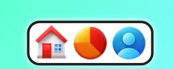
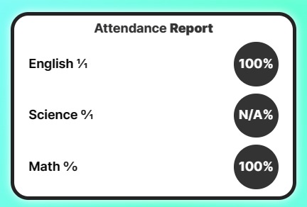

# ✅ Presence - Attendance Tracking Application

Welcome to Presence, an Attendance Tracking Application built using Next.js 13, Web development technologies, Raw CSS, and featuring a unique Thick Line Art Style. This application is designed to help students and professionals keep track of their attendance with ease and simplicity.

## Table of Contents
- [Introduction](#introduction)
- [Features](#features)
- [UX](#ux)
- [Getting Started](#getting-started)
- [Usage](#usage)
- [Report](#report)

## Introduction

Attendance tracking is crucial for students and professionals to stay on top of their academic and professional commitments. Presence aims to simplify this process by providing a user-friendly and aesthetically pleasing interface to manage attendance efficiently.

## Features

- **Dashboard**: Get a clear overview of all the lectures you need to attend for the day.
- **Profile**: Easily enter your subjects as comma-separated values (CSV) and select the corresponding lecture days.
- **Mark Attendance**: Mark your attendance status for each lecture, choosing from options like attended, absent, or cancelled.
- **Attendance Percentage**: See your total academic attendance percentage after marking the attendance.
- **Individual Subject Insights**: Access detailed reports for each subject, including attendance percentage and the number of lectures conducted vs. attended.

## UX

Presence offers a delightful user experience with its intuitive design and thick line art style. When you open the app, you are greeted with a clean and user-friendly dashboard that displays all your lectures for the day. Easily switch between the Dashboard, Profile, and Report tabs to manage your attendance efficiently.

In the Profile section, you can effortlessly add your subjects by entering them as comma-separated values and specifying the corresponding lecture days. This saves you time and ensures your data is well-organized.

In the Dashboard, you can quickly mark your attendance for each lecture, and the app stores this information securely using localStorage. As you mark your attendance, Presence calculates your total academic attendance percentage, helping you monitor your progress effectively.

The Report tab provides in-depth insights into each subject's attendance percentage, giving you a clear picture of your performance in each course.

## Getting Started

To run Presence locally on your machine, follow these steps:
1. Clone the repository: `git clone https://github.com/SujalChoudhari/Presence`
2. Install dependencies: `npm install`
3. Start the development server: `npm run dev`
4. Open your browser and navigate to `http://localhost:3000` to access the app.

## Usage

1. Open the app using the URL.
2. Navigate to the Profile tab and add your subjects as CSV along with their respective lecture days.

3. Switch to the Dashboard tab to view all your lectures for the day.
4. Mark your attendance by selecting attended, absent, or cancelled for each lecture.
5. Once you've marked attendance, your academic attendance percentage will be calculated and displayed.
6. For detailed insights, switch to the Report tab to view the individual attendance percentage for each subject.

## Report

The Report section provides an overview of your attendance performance for each subject. It displays the attendance percentage for each subject along with a comparison of the total number of lectures conducted vs. attended. Use this information to identify areas where improvement is needed and celebrate your attendance success.

Thank you for choosing Presence as your attendance tracking companion! We hope this application makes managing your attendance a breeze. If you have any questions or feedback, feel free to reach out to us. Happy tracking!
